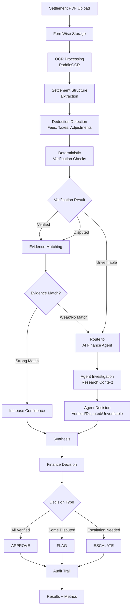
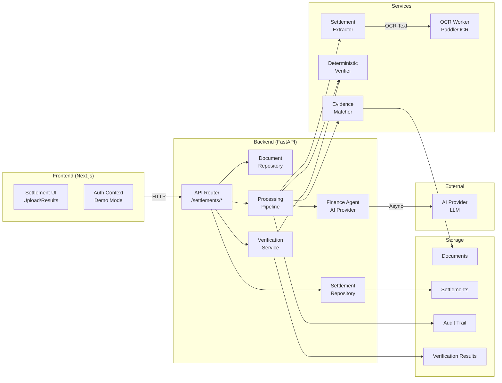
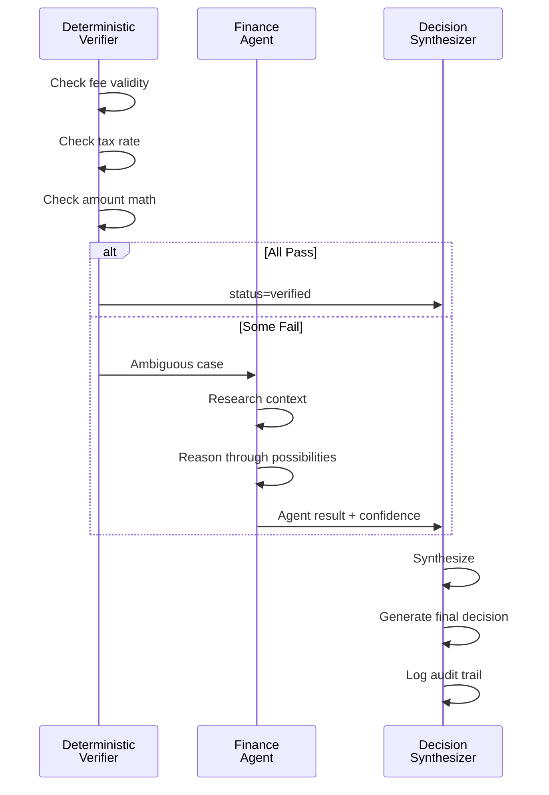
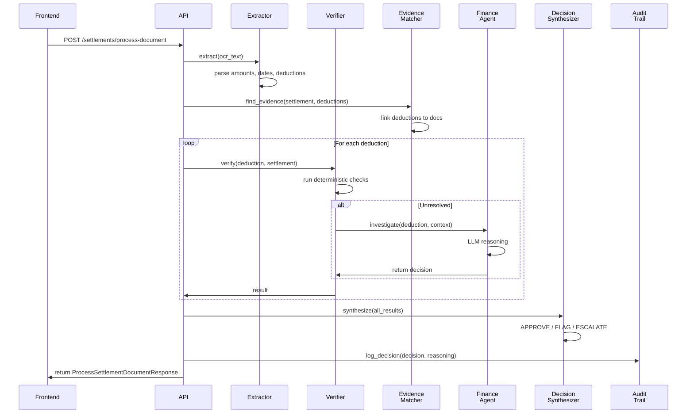

# FormFinance — AI Finance Controller

**Automated settlement verification, deduction reconciliation, evidence matching, and auditable financial decisions powered by deterministic verification and AI-driven investigation.**

**Razorpay AI Buildathon 2026 — Track 04: AI Finance Controller**

---

## Table of Contents

1. [Project Overview](#project-overview)
2. [The Problem](#the-problem)
3. [The Solution](#the-solution)
4. [30-Second Pitch](#30-second-pitch)
5. [Technical Pitch](#technical-pitch)
6. [End-to-End Flow](#end-to-end-flow)
7. [System Architecture](#system-architecture)
8. [Finance Agent Architecture](#finance-agent-architecture)
9. [Settlement Processing Pipeline](#settlement-processing-pipeline)
10. [Core Finance Logic](#core-finance-logic)
11. [Batch Processing & Benchmark](#batch-processing--benchmark)
12. [Razorpay Buildathon Alignment](#razorpay-buildathon-alignment)
13. [API Documentation](#api-documentation)
14. [Frontend](#frontend)
15. [Technology Stack](#technology-stack)
16. [Repository Structure](#repository-structure)
17. [Requirements](#requirements)
18. [Installation & Setup](#installation--setup)
19. [Environment Variables](#environment-variables)
20. [Demo Mode](#demo-mode)
21. [Complete Judge Demo](#complete-judge-demo)
22. [Sample Data](#sample-data)
23. [Testing](#testing)
24. [Build & Verification](#build--verification)
25. [Troubleshooting](#troubleshooting)
26. [Security & Privacy](#security--privacy)
27. [Limitations](#limitations)
28. [Roadmap](#roadmap)
29. [Quick Start](#quick-start)

---

## Project Overview

**FormFinance** is an AI-powered finance controller that automates the reconciliation and verification of financial settlements. It processes settlement documents (PDFs), extracts financial data via OCR, performs deterministic verification checks, matches deductions against evidence, investigates ambiguous cases with an AI finance agent, and produces auditable decisions.

### Who It's For

- **Finance Operations Teams** processing high-volume settlements manually
- **Fintech & Payment Platforms** reconciling settlement reports at scale
- **Compliance & Audit Functions** requiring traceable financial decisions
- **Finance Automation Teams** building deterministic + agentic workflows

### Why It Matters

Manual settlement reconciliation is:
- **Slow**: Hours per document; unscalable at volume
- **Error-prone**: Human oversight, missed discrepancies
- **Unauditable**: No trace of reasoning or verification logic
- **Repetitive**: Same checks applied document-after-document

FormFinance solves this by turning reconciliation into a transparent, repeatable, auditable workflow that combines fast deterministic checks with targeted AI investigation for ambiguous cases.

---

## The Problem

### Settlement Verification Challenges

A settlement report contains:
- Gross transaction amount
- Refunds and reversals
- Platform/merchant fees
- Taxes and statutory deductions
- Adjustments and chargebacks
- **Net settlement amount** (what should actually be paid)

**Why this is hard to reconcile:**
1. **Structural extraction**: OCR alone doesn't understand settlement semantics—amounts must be parsed from context
2. **Deduction verification**: Each deduction type (fee, tax, chargeback) has different rules for validity
3. **Evidence matching**: Deductions must be matched against supporting evidence (invoice, policy, regulation)
4. **Exception handling**: Some deductions are ambiguous and require investigation
5. **Audit trail**: Finance requires proof of what was checked and why a decision was made
6. **Scale**: A single payment platform processes thousands of settlements daily

**Current state (manual):**
```
Finance team → PDF settlement → Manual reading → Spreadsheet extraction
→ Manual verification (rule-by-rule) → Email back-and-forth on disputes
→ Spreadsheet-based audit → Weeks to close
```

**Cost of failure:**
- Undetected fraud or errors: Millions in exposure
- Processing delays: Settlement cycles disrupted
- Audit gaps: Regulatory non-compliance
- Scaling ceiling: Cannot grow without proportional hiring

---

## The Solution

FormFinance delivers an **end-to-end settlement verification pipeline**:

```
Settlement PDF
  ↓
[OCR Extraction]          (PaddleOCR → text extraction)
  ↓
[Structured Parsing]      (Settlement extractor → amounts, dates, types)
  ↓
[Deduction Detection]     (Extract fees, taxes, adjustments, chargebacks)
  ↓
[Deterministic Checks]    (Business rules → verified/disputed/unverifiable)
  ↓
[Evidence Matching]       (Link deductions to supporting documents)
  ↓
[Unresolved → AI Investigation] (Finance agent → research ambiguous cases)
  ↓
[Decision]                (APPROVE / FLAG / ESCALATE)
  ↓
[Audit Trail]             (Every check, result, and reasoning logged)
  ↓
[Batch Results & Metrics] (50+ records → throughput, accuracy, exceptions)
```

### Key Capabilities

| Capability | Description |
|---|---|
| **Document Ingestion** | Settlement PDFs uploaded to FormWise storage |
| **OCR Processing** | PaddleOCR extracts text, page layout, structured data |
| **Settlement Extraction** | Parsed gross, refunds, fees, taxes, net amounts |
| **Deterministic Verification** | Rule-based checks on deduction types, amounts, dates |
| **Deduction Verification** | Each deduction categorized: verified / disputed / unverifiable |
| **Evidence Matching** | Deductions linked to supporting documents with confidence scoring |
| **AI Finance Agent** | LLM-based agent investigates unresolved deductions |
| **Decision Generation** | APPROVE (all checks pass), FLAG (discrepancies), ESCALATE (manual review needed) |
| **Audit Trail** | Complete record of checks, results, agent reasoning, and final decision |
| **Batch Processing** | 50+ settlements processed end-to-end with metrics |
| **Metrics & Reporting** | Extraction success, verification rate, evidence match rate, exception tracking |

---

## 30-Second Pitch

> FormFinance automates settlement reconciliation for payment platforms. Upload a settlement PDF → OCR extracts amounts → AI verifies deductions against rules and evidence → Finance decision (approve/flag/escalate) generated with full audit trail. Process 50+ settlements in seconds with measurable accuracy.

---

## Technical Pitch

FormFinance is a settlement verification pipeline that combines **deterministic rule-based verification** with **targeted AI investigation** for ambiguous cases. 

The architecture:
1. **Document Layer**: Uploads and storage via FormWise
2. **OCR Layer**: PaddleOCR extracts settlement structure and amounts
3. **Extraction Layer**: Parses settlement semantics (deductions, types, amounts, dates)
4. **Verification Layer**: Deterministic checks on business rules (fee validity, tax compliance, amount consistency)
5. **Evidence Layer**: Links deductions to supporting documents; computes match confidence
6. **Agent Layer**: LLM-powered finance agent investigates failures in deterministic checks
7. **Decision Layer**: Synthesis of verification results and agent investigation → APPROVE/FLAG/ESCALATE
8. **Audit Layer**: Complete provenance of checks, reasoning, and outcomes
9. **Batch Layer**: Processes 50+ settlements; produces metrics (extraction rate, verification rate, throughput)

**Why agentic?**
- Deterministic checks are fast and rule-based but have limits (ambiguous amounts, missing evidence)
- When deterministic checks fail, the agent receives context (deduction type, amount, evidence) and investigates
- Agent uses reasoning (not lookup) to decide whether ambiguity can be resolved
- Agent results feed into final decision
- The combination: most decisions deterministic (fast) + complex cases AI-driven (thorough)

**Why it fits Track 04 (AI Finance Controller):**
- Automates a repetitive finance workflow (settlement reconciliation)
- Uses AI to handle exceptions and ambiguity
- Produces auditable, verifiable decisions
- Scales (50+ records with metrics)
- Measurable accuracy and throughput

---

## End-to-End Flow



---

## System Architecture

### High-Level Architecture



### Component Responsibilities

| Component | Responsibility |
|---|---|
| **Frontend (Next.js)** | Settlement upload, results display, batch demo UI, demo auth |
| **API Router** | HTTP endpoints for upload, extraction, verification, batch processing |
| **Document Repository** | Store/retrieve PDFs, OCR text; FormWise integration |
| **Settlement Repository** | Store/retrieve settlement records and deductions |
| **OCR Worker** | Background PaddleOCR processing |
| **Settlement Extractor** | Parse OCR text → settlement amounts, deductions, metadata |
| **Deterministic Verifier** | Rule-based verification: fee validity, tax compliance, amount checks |
| **Evidence Matcher** | Link deductions to supporting documents; compute confidence |
| **Finance Agent** | LLM-based investigation of ambiguous deductions |
| **AI Provider** | Interface to LLM (Anthropic, OpenAI, etc.) |
| **Verification Service** | Orchestrate verification workflow (deterministic + agent) |
| **Processing Pipeline** | End-to-end settlement processing (extract → verify → decide → audit) |
| **Audit Repository** | Store audit events (checks, reasoning, decisions) |
| **Decision Repository** | Store final settlement decisions |

---

## Finance Agent Architecture

### When Is the Agent Invoked?

The agent is invoked when deterministic verification **cannot confidently decide** on a deduction:

```python
if verification_result.status == "unverifiable":
    # Invoke AI agent to investigate
    agent_result = await finance_agent.investigate_deduction(
        deduction,
        settlement,
        verification_context={"error": "Low confidence", "confidence": 0.45}
    )
```

### What Does the Agent Receive?

- **Deduction data**: type, amount, reference ID, date, confidence
- **Settlement context**: gross amount, net settlement, other deductions, dates
- **Verification context**: What failed? (e.g., "Low confidence in fee calculation")
- **Evidence**: Supporting documents and extracted evidence
- **History**: Prior similar deductions and their outcomes

### How Does the Agent Investigate?

The agent:
1. **Receives** deduction + context
2. **Reasons** through possibilities:
   - Is the amount reasonable given settlement size?
   - Does the deduction type match the context?
   - Is there evidence to support or refute it?
   - Are there policy/regulatory reasons for this deduction?
3. **Produces** a decision: `"verified"` / `"disputed"` / `"unverifiable"`
4. **Confidence** score (0.0–1.0)
5. **Reasoning** (logged for audit)

### Agent Output

```json
{
  "decision": "verified",
  "confidence": 0.82,
  "reasoning": "Chargeback deduction of 500 INR matches typical disputed transaction pattern. Supporting evidence confirms customer dispute lodged 2 days before settlement date.",
  "investigation_status": "completed"
}
```

### How Deterministic + Agent Interact



---

## Settlement Processing Pipeline

### Complete Pipeline Workflow

```python
# Pseudocode: What happens when a settlement document is processed

async def process_settlement_document(document_id, owner_uid, evidence_doc_ids):
    # 1. Load document from storage
    document = document_repo.get(document_id)
    ocr_text = ocr_store.get(document_id)
    
    # 2. Extract settlement structure
    settlement = extractor.extract(ocr_text)
    settlement.owner_uid = owner_uid
    settlement_repo.create(settlement)
    
    # 3. Extract deductions
    deductions = extractor.extract_deductions(ocr_text)
    for deduction in deductions:
        deduction_repo.create(deduction)
    
    # 4. Find evidence documents
    evidence_links = evidence_matcher.find_evidence(
        settlement, deductions, evidence_doc_ids
    )
    
    # 5. Run deterministic verification
    for deduction in deductions:
        result = verifier.verify(deduction, settlement)
        verification_repo.create(result)
        
        # 6. If unresolved, invoke agent
        if result.status == "unverifiable":
            agent_result = await agent.investigate(
                deduction, settlement, result.context
            )
            verification_repo.update(result, agent_result)
    
    # 7. Generate final decision
    decision = synthesize_decision(verification_results)
    decision_repo.create(decision)
    
    # 8. Log audit trail
    audit_repo.create(FinanceAuditEvent(...))
    
    return SettlementResult(settlement, deductions, decision, audit_trail)
```

### Sequence Diagram



---

## Core Finance Logic

### Settlement Model

```python
class Settlement:
    id: str                      # Unique settlement ID
    owner_uid: str               # User who owns this settlement
    source: str = "razorpay"     # Settlement source (e.g., Razorpay)
    settlement_date: datetime    # When settlement was processed
    gross_amount: float          # Total transaction amount
    net_amount: float            # Amount to be paid (after deductions)
    currency: str = "INR"        # Currency
    ocr_text: str                # Extracted OCR text from PDF
    extraction_status: str       # "pending" | "extracted" | "failed"
    created_at: datetime
```

### Deduction Model

```python
class SettlementDeduction:
    id: str                      # Unique deduction ID
    settlement_id: str           # Parent settlement
    type: str                    # "fee" | "tax" | "chargeback" | "adjustment"
    description: str             # Human-readable description
    amount: float                # Deduction amount
    reference_id: str | None     # Transaction/policy/regulation ID
    reference_date: str | None   # Date associated with deduction
    confidence: float            # Extraction confidence (0.0–1.0)
    created_at: datetime
```