# FormWise AI

FormWise AI is a privacy-first, AI-assisted form-filling platform. It accepts PDF and image forms, quarantines and scans uploads, extracts text and layout, applies a privacy policy before any AI use, builds an immutable Field Map v1, supports safe conversations and assignments, renders approved values, provides authenticated downloads, and asynchronously purges revoked conversations.

The product is intended for users who need help understanding and completing forms without sending direct identifiers or protected values to an AI provider. Firebase Authentication and Firestore provide identity and metadata; file artifacts use the local filesystem in development. Firebase Cloud Storage is **not required** for local development.

> Architecture note: the Software Design Document is frozen. This repository implements the approved boundaries; the `docs/` directory contains the detailed design records that this README consolidates operationally.

## Contents

- [Architecture](#architecture)
- [Visual architecture and execution guide](#visual-architecture-and-execution-guide)
- [Repository map](#repository-map)
- [Prerequisites and setup](#prerequisites-and-setup)
- [Configuration](#configuration)
- [Running the system](#running-the-system)
- [API reference](#api-reference)
- [Data, storage, queues, and indexes](#data-storage-queues-and-indexes)
- [Security and privacy](#security-and-privacy)
- [Testing, troubleshooting, deployment, and maintenance](#testing-troubleshooting-deployment-and-maintenance)

## Architecture

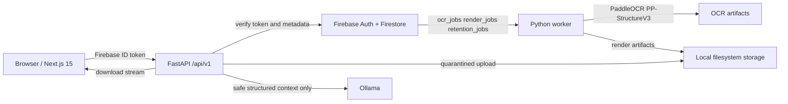

### End-to-end lifecycle

1. The Next.js application signs in with Firebase Google Auth and sends an ID token to `GET /api/v1/me`.
2. The API validates the Firebase token, creates/updates `users/{uid}`, and returns the server profile.
3. A browser asks for a signed upload intent, then uploads directly to the API's local storage target. Files arrive in `storage/quarantine`.
4. The worker polls `ocr_jobs`, runs the fail-closed scan hook, releases a clean file to `storage/uploads`, and runs PaddleOCR.
5. The API privacy scan reads OCR artifacts, persists a safe privacy report, and writes protected/redacted artifacts separately.
6. Form Understanding consumes protected output plus native PDF widget metadata, persists `structured_documents`, and freezes Field Map v1 semantics.
7. Assignment generation operates only on permitted fields. Conversations consume structured documents only; Ollama is selected through the AI provider abstraction.
8. A render job consumes the immutable original, Field Map v1, and approved assignments. The worker writes a render artifact and a render record; the API streams the completed artifact to its owner.
9. Conversation revocation is immediate. The retention worker asynchronously deletes associated records and artifacts and writes response-safe audit events.

### Boundary rules

- The frontend never verifies identity itself; protected API calls carry `Authorization: Bearer <Firebase-ID-token>`.
- The API owns HTTP, Firebase/Firestore adapters, authorization, and orchestration entry points.
- The worker owns long-running OCR, rendering, queue polling, retries, retention, and local artifact adapters.
- `packages/document-core/python` contains provider-neutral rendering, privacy, and retention models/contracts. It has no FastAPI, Firestore, queue, renderer, or storage implementation.
- AI consumes structured, privacy-safe context only. It must not read raw uploads, raw OCR, protected OCR, privacy reports, or direct identifiers.

## Visual architecture and execution guide

This guide maps the code that actually runs today. Read each diagram from left to right for dependencies and top to bottom for execution. Dotted arrows identify a persisted queue or artifact boundary; solid arrows identify an in-process import, call, or request.

### Complete system architecture

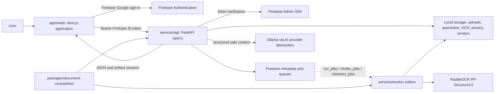

The browser owns presentation and Firebase browser authentication. FastAPI is the trusted HTTP boundary: it verifies tokens, authorizes access, writes metadata, and enqueues durable work. The worker is the only long-running processor. API and worker share only provider-neutral contracts from `formwise_document_core`, Firestore metadata, and the configured artifact locations.

### Repository structure and folder dependency flow

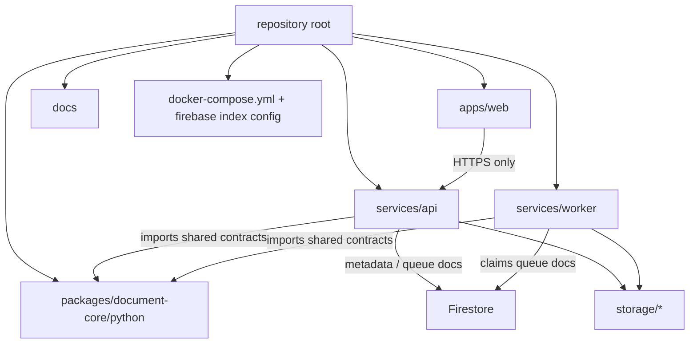

`apps/web` never imports Python code. `services/api` and `services/worker` are separate Python services registered in the root uv workspace; each imports the shared Python package but does not import the other service. The TypeScript packages under `packages/` are boundary placeholders, not live Python runtime dependencies. `docs/` records the frozen design and operational procedures rather than participating in application execution.

### Folder responsibilities and runtime order

| Folder                                                     | Responsibility                                                              | Depends on                                        | Imported or used by     | Runtime position                                   |
| ---------------------------------------------------------- | --------------------------------------------------------------------------- | ------------------------------------------------- | ----------------------- | -------------------------------------------------- |
| `apps/web/src/app`                                         | Route pages and protected application shell                                 | components, auth context                          | Next.js App Router      | Browser entry and page composition                 |
| `apps/web/src/components`                                  | Feature and shell UI                                                        | contexts, services, UI primitives                 | Route pages             | Renders state and invokes service clients          |
| `apps/web/src/services`                                    | Browser HTTP clients                                                        | API URL and Firebase token                        | Components and context  | Sends authenticated requests                       |
| `services/api/src/formwise_api/api.py` and feature routers | Versioned HTTP routing                                                      | dependencies, services                            | `main.py`               | Receives browser requests                          |
| `services/api/src/formwise_api/*` feature modules          | Authorization, orchestration, Firestore adapters                            | Firebase Admin, Firestore, storage, shared models | Routers                 | Validates and persists or enqueues work            |
| `packages/document-core/python`                            | Immutable models and provider-neutral rendering/privacy/retention contracts | Pydantic and standard Python                      | API and worker          | Shared boundary, no infrastructure ownership       |
| `services/worker/src/formwise_worker`                      | Queue claim loops and concrete OCR/render/retention implementations         | Firestore, storage, providers, shared contracts   | worker `main.py`        | Executes durable background work                   |
| `storage/*`                                                | Local development artifacts                                                 | configured filesystem paths                       | API and worker adapters | Stores immutable originals and generated artifacts |

### Frontend component and request flow

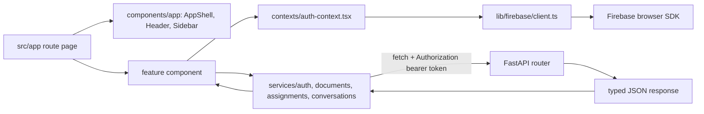

Each route page composes existing components; feature components call a client in `src/services` instead of constructing HTTP requests inline. `AuthProvider` supplies both the Firebase user and verified backend profile. The client retrieves an ID token using the Firebase SDK, the API validates it, and the resulting response updates React component state.

### API module flow and dependency boundaries

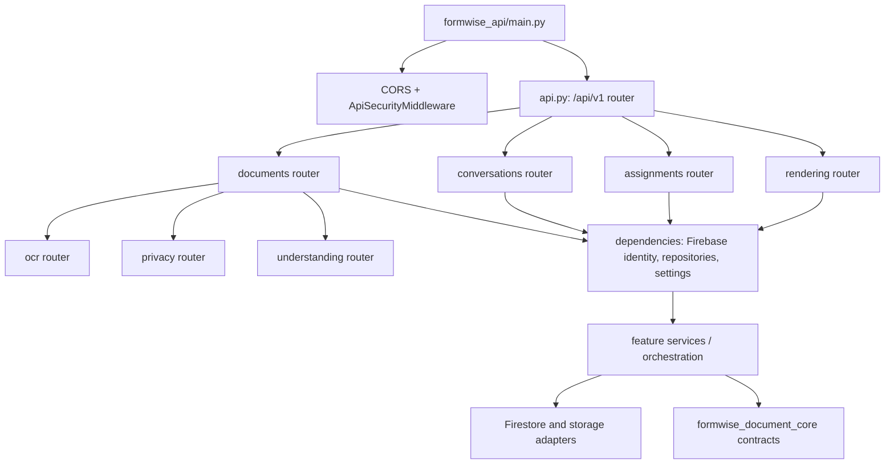

`main.py` is the API composition root. It applies middleware before router registration. Feature routers call dependency providers for the authenticated Firebase identity and concrete repositories; repositories isolate Firestore and storage details from route handlers. The documents route includes the OCR, privacy, and understanding subrouters, so those HTTP modules stay under a single document boundary.

### Authentication lifecycle

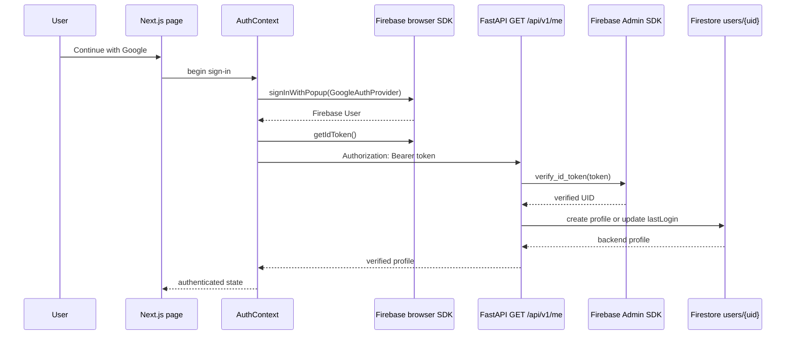

The frontend does not parse or trust a token as identity proof. The backend verifies it on every protected request and returns the Firestore-backed profile that the authenticated UI consumes. Browser session persistence is handled by the Firebase browser SDK; backend authorization always begins again with the bearer token.

### Upload and quarantine lifecycle

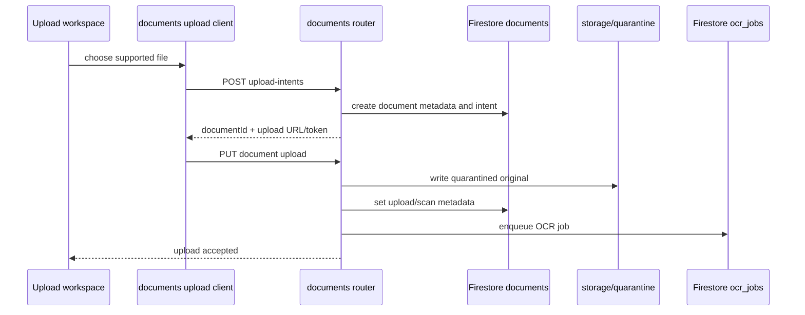

The browser first receives an upload intent, then performs the configured upload request. The original enters quarantine rather than an OCR path. Firestore stores document metadata and the identifier-only OCR job; the file bytes remain in local storage during development. CORS preflight is handled by API middleware before upload route logic.

### OCR and native-layout lifecycle

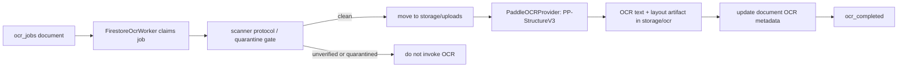

The worker’s OCR poller claims a Firestore queue record, checks quarantine/scan state, and fails closed for files not released to processing. PaddleOCR produces text and retained layout information as a separate artifact; the original upload is not changed. The document record tracks OCR status, provider, confidence, and text length.

### Privacy engine lifecycle

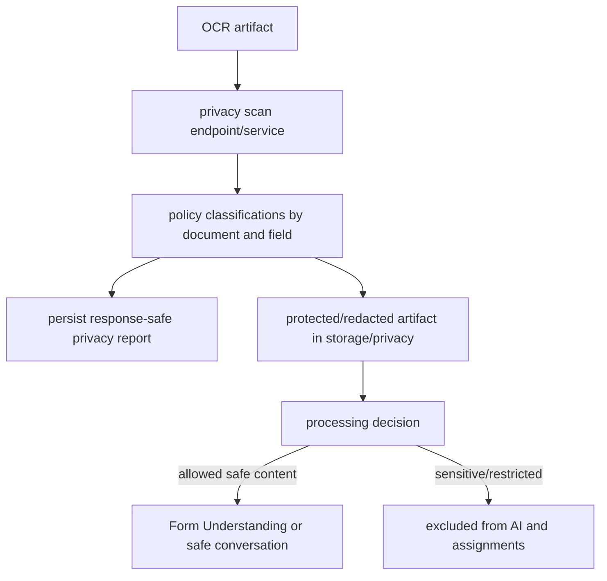

The privacy boundary is before downstream AI use. Classification produces a report and a protected artifact, but sensitive/restricted values are quarantined from provider input. `ASK_USER` controls whether processing can continue with already protected content; it never permits raw sensitive values to bypass the policy boundary.

### Form Understanding and Field Map v1 lifecycle

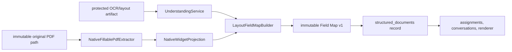

Understanding consumes protected OCR/layout output and, only for native fillable PDFs, deterministic widget metadata from the immutable original. The builder persists geometry and rendering semantics as Field Map v1. Native metadata includes the known widget reference (`widgetXref`) when available; renderers later dereference only that persisted identifier and do not rediscover document structure.

### Assignment generation lifecycle

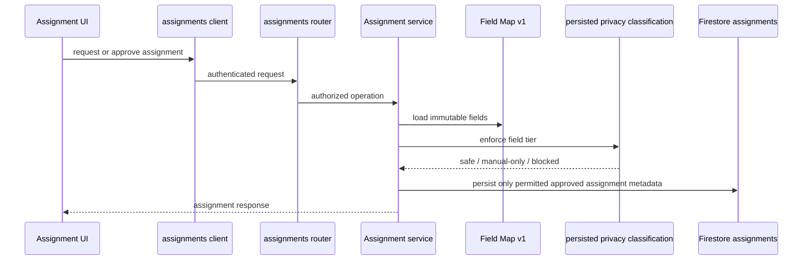

Assignments are derived from Field Map v1 and the privacy decision. SAFE fields can participate in questions and approved assignments. SENSITIVE and RESTRICTED fields become value-free manual-only records; BLOCK terminates the workflow. This prevents values protected by policy from being stored or sent to AI.

### Conversation lifecycle

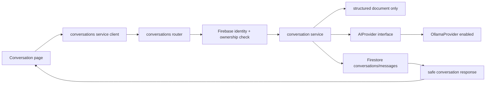

Conversations are first-class resources. The service loads the structured document rather than raw uploads, OCR, protected text, privacy reports, or assignments. The provider abstraction chooses Ollama from configuration today; Gemini and Groq remain disabled placeholders. Conversation retention caps are enforced through revocation and asynchronous retention processing.

### Rendering lifecycle and publication safety

```mermaid
flowchart LR
  API["rendering router"] --> Queue["render_jobs: identifiers only"]
  Queue -. "claim" .-> Worker["FirestoreRenderWorker"]
  Worker --> Load["load original, Field Map v1, approved assignments"]
  Load --> Validate["RenderValidator"]
  Validate --> Factory["RendererFactory"]
  Factory --> Renderer["fillable PDF / static PDF / image renderer"]
  Renderer --> Temp["execution-specific temporary artifact"]
  Temp --> Guard["active execution token guard"]
  Guard -->|"still active"| Promote["promote to final render artifact"]
  Guard -->|"timed out or superseded"| Discard["discard temporary artifact"]
  Promote --> Record["Firestore render record"]
  Record --> Download["authenticated download endpoint"]
```

The renderer receives exactly the immutable original, Field Map v1, and approved assignments. For fillable PDFs it opens the persisted page and dereferences only the persisted `widgetXref`, then verifies `widgetId` and `widgetType`; static PDFs and images use persisted coordinates and semantics. The execution guard prevents a timed-out background thread from publishing a stale artifact after a retry has superseded it.

### Worker architecture, retries, and queue flow

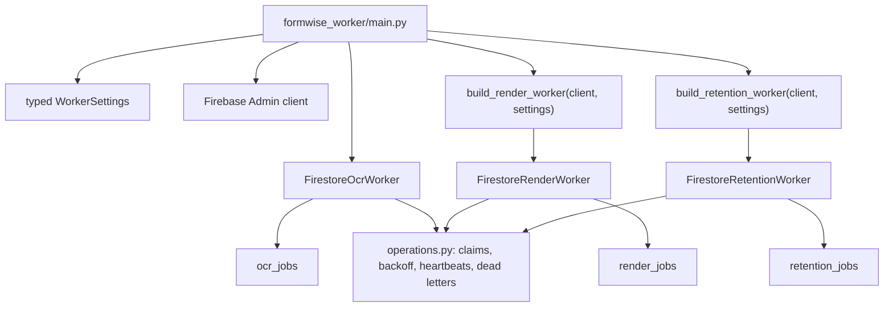

Worker startup builds each poller once and runs them under the existing lifecycle. Queue documents contain orchestration metadata only; workers reload immutable domain inputs from their repositories. Retry/backoff, attempt tracking, heartbeats, configured timeouts, and dead-letter metadata are centralized in worker operations rather than duplicated in feature code.

### Firestore collections and relationships

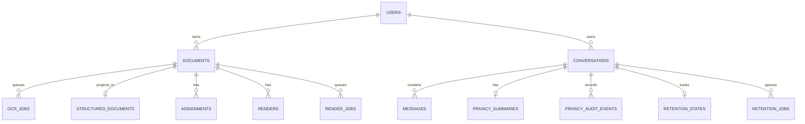

Firestore holds metadata, profiles, projections, assignments, conversation records, queue state, and response-safe privacy/retention data. Artifacts are stored separately under configured filesystem paths. The worker queue queries require the composite indexes in `firestore.indexes.json`; deploy them with the Firebase CLI before expecting remote Firestore polling to work.

### Shared Python package dependency graph

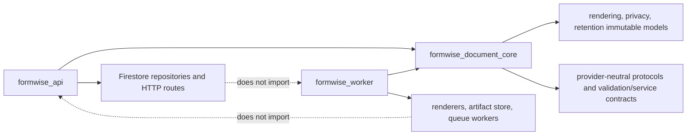

The shared package is installed by both Python services through the root uv workspace. It intentionally excludes FastAPI routers, Firestore adapters, queue runtime, concrete renderers, and local artifact storage. This keeps API and worker dependencies acyclic while allowing both to use the same immutable models and provider-neutral contracts.

### Startup and dependency initialization flow

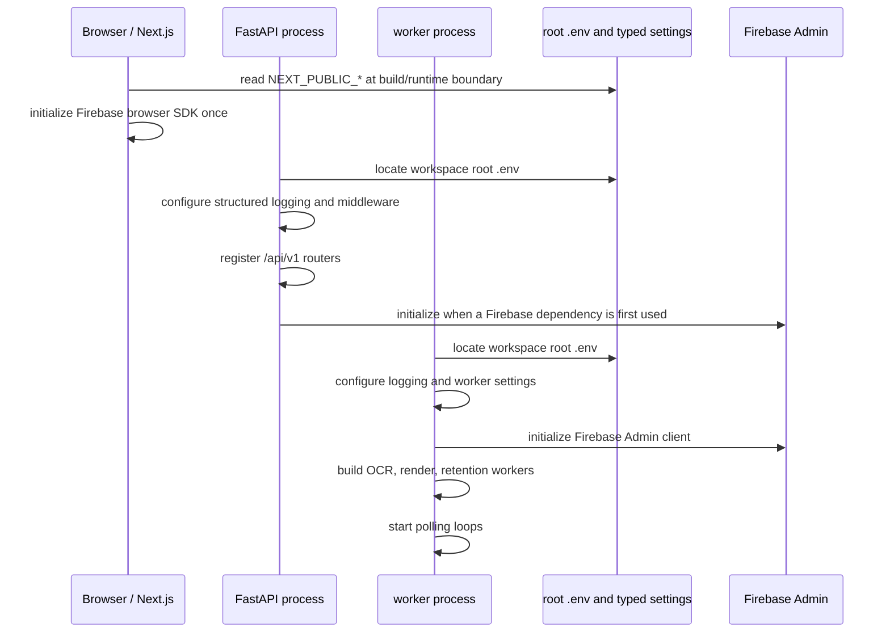

The API and worker configuration modules locate the workspace `.env` even when launched from their own service directories. Relative `FIREBASE_SERVICE_ACCOUNT_PATH` values resolve beside that discovered environment file, while absolute paths and `FIREBASE_SERVICE_ACCOUNT_JSON` continue to work. Firebase browser initialization is isolated to the client module and guarded so it happens only once.

### Docker and shared artifact topology

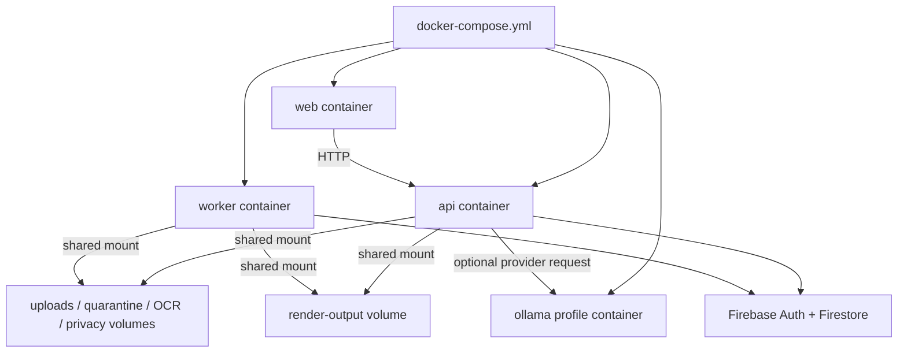

Docker uses the same artifact volumes for API and worker so the API can stream completed render artifacts that the worker writes. The shared Python package is copied and installed during both API and worker image builds through the uv workspace configuration; no Docker-only `file:///app/...` dependency is required.

### Complete end-to-end user journey

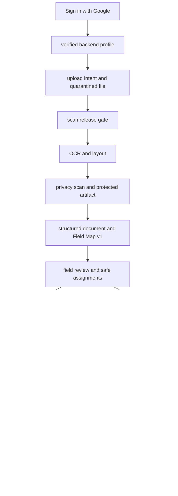

Not every user journey needs every branch: a user can render after approved assignments without starting a conversation. The privacy boundary remains invariant across both branches. Deletion revokes access first and queues durable purge work; the UI must not imply that physical artifact deletion is synchronous.

### Debugging and request-tracing flow

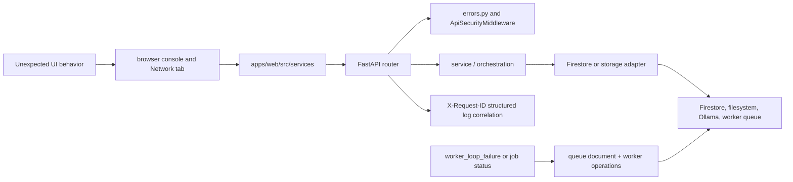

Start with the browser Network request and its `X-Request-ID`, then follow the corresponding structured API log through the router, service, and repository. For background work, inspect the relevant queue document and worker logs rather than expecting the initial API request to perform OCR, rendering, or retention synchronously. Useful commands are listed in [Testing, troubleshooting, deployment, and maintenance](#testing-troubleshooting-deployment-and-maintenance).

## Repository map

```text
.
├── apps/web/                         Next.js 15 browser client
├── services/api/                     FastAPI application and Firestore adapters
├── services/worker/                  OCR, rendering, and retention process
├── packages/
│   ├── ai-provider/                  TypeScript provider placeholder package
│   ├── contracts/                    TypeScript shared-contract placeholder package
│   ├── document-core/                TypeScript placeholder + shared Python package
│   └── policy/                       TypeScript policy placeholder package
├── docs/                             Frozen SDD and subsystem/operations documentation
├── infra/                            Reserved infrastructure-as-code location
├── tests/                            Cross-service test guidance
├── firebase.json                     Firebase CLI Firestore-index configuration
├── firestore.indexes.json            Required composite indexes for worker queues
├── docker-compose.yml                Web, API, worker, and optional Ollama topology
├── package.json / package-lock.json  npm workspace and frontend lockfile
├── pyproject.toml / uv.lock          uv Python workspace and lockfile
└── .env.example                      Root API/worker/web-build configuration template
```

### Folders and ownership

| Location                                                                  | Purpose and consumers                                                                                                                                                                                                             |
| ------------------------------------------------------------------------- | --------------------------------------------------------------------------------------------------------------------------------------------------------------------------------------------------------------------------------- |
| `apps/web/src/app`                                                        | App Router pages. `/` gates unauthenticated users; `/app/*` is the protected shell. Components call `src/services/*` rather than FastAPI directly.                                                                                |
| `apps/web/src/components`                                                 | Shell/navigation, auth screen, upload/OCR/privacy/understanding/assignment/conversation UI, and basic UI primitives. Imported by route pages.                                                                                     |
| `apps/web/src/contexts/auth-context.tsx`                                  | Firebase user + backend profile state. Used by protected layouts and feature components.                                                                                                                                          |
| `apps/web/src/services`                                                   | Typed browser fetch clients for authentication, documents, assignments, and conversations.                                                                                                                                        |
| `services/api/src/formwise_api`                                           | FastAPI composition root (`main.py`), versioned router (`api.py`), dependencies, repositories, services, and HTTP error mapping.                                                                                                  |
| `services/api/.../documents`, `ocr`, `privacy`, `understanding`           | Upload intent, upload completion, OCR start/status, privacy scan/consent, and structured-document operations.                                                                                                                     |
| `services/api/.../conversations`, `assignments`, `rendering`, `retention` | Safe chat, field assignments, render enqueue/status/download, and revoke-and-enqueue retention orchestration.                                                                                                                     |
| `services/worker/src/formwise_worker`                                     | `main.py` starts OCR/render/retention loops. `operations.py` contains queue claims, retry backoff, timeout helpers, heartbeat, and dead-letter metadata.                                                                          |
| `services/worker/.../ocr`                                                 | PaddleOCR provider, native layout storage, quarantine scanner protocol, and OCR worker.                                                                                                                                           |
| `services/worker/.../rendering`                                           | Concrete PDF/image renderers, factory, local artifact store, render-job worker, and composition root.                                                                                                                             |
| `services/worker/.../retention`                                           | Firestore retention job adapter, purge adapter, audit recorder, and retention worker.                                                                                                                                             |
| `packages/document-core/python/src/formwise_document_core`                | Shared immutable Pydantic models: rendering records/results/validation, privacy summary/audit event, retention state/job/status, RenderService and RenderValidator. Imported by API and worker through uv workspace dependencies. |
| `packages/*/src/index.ts`                                                 | TypeScript boundary placeholders. They compile with the npm workspace but are not current runtime business-logic dependencies.                                                                                                    |
| `docs/`                                                                   | `SOFTWARE_DESIGN_DOCUMENT.md` is the source design; subsystem documents describe upload, OCR, privacy, understanding, assignments, conversation, rendering, and release operations.                                               |
| `infra/README.md`                                                         | Placeholder explaining that infrastructure-as-code has not yet been added.                                                                                                                                                        |

### Important files

| File                                                                        | Role / execution point                                                                                                                  |
| --------------------------------------------------------------------------- | --------------------------------------------------------------------------------------------------------------------------------------- |
| `package.json`                                                              | npm root workspace, build/lint/typecheck/test/format commands.                                                                          |
| `pyproject.toml`                                                            | uv root workspace; registers API, worker, and shared Python document core.                                                              |
| `services/api/pyproject.toml`                                               | API dependencies, setuptools packaging, Ruff/Mypy/Pytest configuration.                                                                 |
| `services/worker/pyproject.toml`                                            | Worker dependencies including PaddleOCR, PyMuPDF, Pillow, and shared Python package.                                                    |
| `apps/web/package.json`                                                     | Next scripts and React/Firebase/Tailwind dependencies.                                                                                  |
| `apps/web/src/lib/firebase/client.ts`                                       | Validates public Firebase configuration, initializes the modular SDK once, and enables browser-local persistence.                       |
| `apps/web/src/config/env.ts`                                                | Zod-validates public browser variables at application start.                                                                            |
| `services/api/src/formwise_api/main.py`                                     | Creates FastAPI, CORS and security middleware, registers `/api/v1`, and starts structured logging.                                      |
| `services/api/src/formwise_api/config.py` / `services/worker/.../config.py` | Typed Pydantic settings; locate the workspace `.env` when run from a service directory and resolve relative credential paths beside it. |
| `services/api/src/formwise_api/errors.py`                                   | Stable, production-safe HTTP error response mapping.                                                                                    |
| `services/api/src/formwise_api/middleware.py`                               | Request ID correlation and response security headers.                                                                                   |
| `services/worker/src/formwise_worker/main.py`                               | Worker entry point; runs OCR, render, and retention pollers concurrently.                                                               |
| `firebase.json` + `firestore.indexes.json`                                  | Firebase CLI index deployment configuration. No Firestore rules file is present.                                                        |
| `docker-compose.yml`                                                        | Local containers, shared named artifact volumes, and optional `ollama` profile.                                                         |

## Prerequisites and setup

### Required software

| Tool             | Required version / purpose                                                                 |
| ---------------- | ------------------------------------------------------------------------------------------ |
| Git              | Clone and update the repository.                                                           |
| Node.js          | Node 24 is used by the web Docker image; npm 11 is declared in `package.json`.             |
| Python           | Python 3.13 or newer, required by the uv workspace.                                        |
| uv               | Python dependency/workspace manager.                                                       |
| Firebase project | Google Authentication enabled and Firestore in Native mode.                                |
| Firebase CLI     | Required to deploy `firestore.indexes.json`; install with `npm install -g firebase-tools`. |
| Ollama           | Required only for Safe Chat; run locally or use the Compose `ai` profile.                  |
| Docker Desktop   | Optional local container workflow.                                                         |

Windows, macOS, and Linux use the same repository commands. Install Git, Node, Python, Docker, and Firebase CLI with the platform's supported installer/package manager. Install uv from [Astral's uv installation guide](https://docs.astral.sh/uv/getting-started/installation/).

```bash
git clone <repository-url>
cd formwise-ai
npm ci
uv sync
copy .env.example .env              # Windows cmd; use cp on macOS/Linux
copy apps/web/.env.local.example apps/web/.env.local
```

Fill `.env` and `apps/web/.env.local` with the values described below. Do not commit either file or `secrets/firebase-admin.json`.

### Firebase bootstrap

1. Create/select a Firebase project and create a Firestore database in Native mode.
2. Enable **Authentication → Google** and add `localhost` to authorized domains for local development.
3. In **Project settings → General → Your apps**, create a web app and copy its SDK configuration into `apps/web/.env.local`.
4. Create an Admin SDK service account with Firestore access. Either set `FIREBASE_SERVICE_ACCOUNT_JSON` through a secret manager or save the JSON locally and set `FIREBASE_SERVICE_ACCOUNT_PATH=secrets/firebase-admin.json`.
5. Authenticate Firebase CLI, choose the project, and deploy indexes:

```bash
firebase login
firebase use <firebase-project-id>
firebase deploy --only firestore:indexes --project <firebase-project-id>
```

Wait for all indexes to become **Enabled** before starting the worker. The three queue indexes are required for worker polling.

## Configuration

The root `.env` is loaded by API and worker. The web app reads `apps/web/.env.local` in direct development and receives `NEXT_PUBLIC_*` build arguments in Docker.

| Variable                                                                                                                                |      Required locally | Default / example                                            | Read by     | Purpose                                                                                                                                                       |
| --------------------------------------------------------------------------------------------------------------------------------------- | --------------------: | ------------------------------------------------------------ | ----------- | ------------------------------------------------------------------------------------------------------------------------------------------------------------- |
| `FIREBASE_PROJECT_ID`                                                                                                                   |                   Yes | `your-project-id`                                            | API, worker | Firebase/Firestore project selection.                                                                                                                         |
| `FIREBASE_SERVICE_ACCOUNT_JSON`                                                                                                         | One credential source | empty                                                        | API, worker | Admin SDK JSON secret; never expose to browser.                                                                                                               |
| `FIREBASE_SERVICE_ACCOUNT_PATH`                                                                                                         | One credential source | `secrets/firebase-admin.json`                                | API, worker | Relative paths resolve beside root `.env`; absolute paths work.                                                                                               |
| `UPLOAD_SIGNING_SECRET`                                                                                                                 |                   Yes | random long secret                                           | API         | HMAC signs local upload intents.                                                                                                                              |
| `NEXT_PUBLIC_APP_URL`                                                                                                                   |                   Yes | `http://localhost:3000`                                      | web         | Browser application URL.                                                                                                                                      |
| `NEXT_PUBLIC_API_BASE_URL`                                                                                                              |                   Yes | `http://localhost:8000/api/v1`                               | web         | FastAPI base URL.                                                                                                                                             |
| `NEXT_PUBLIC_FIREBASE_API_KEY`, `...AUTH_DOMAIN`, `...PROJECT_ID`, `...MESSAGING_SENDER_ID`, `...APP_ID`                                |                   Yes | Firebase web SDK values                                      | web         | Public Firebase client configuration.                                                                                                                         |
| `NEXT_PUBLIC_FIREBASE_STORAGE_BUCKET`                                                                                                   |              Optional | Firebase web metadata                                        | web         | Not used by local artifact storage.                                                                                                                           |
| `FORMWISE_ENV`                                                                                                                          |              Optional | `development`                                                | API         | `development`, `staging`, or `production`; production enables stricter validation.                                                                            |
| `LOG_LEVEL`                                                                                                                             |              Optional | `INFO`                                                       | API, worker | Structured logging level.                                                                                                                                     |
| `CORS_ALLOWED_ORIGINS`                                                                                                                  |              Optional | `["http://localhost:3000"]`                                  | API         | JSON list of permitted browser origins. Never use `*`.                                                                                                        |
| `CORS_ALLOWED_METHODS`                                                                                                                  |              Optional | `GET,POST,PUT,PATCH,DELETE,OPTIONS`                          | API         | Must retain `PUT` for direct upload target preflight.                                                                                                         |
| `CORS_ALLOWED_HEADERS`                                                                                                                  |              Optional | includes `Authorization`, `Content-Type`, `Origin`, `Accept` | API         | Browser preflight header allowlist.                                                                                                                           |
| `LOCAL_STORAGE_PATH`, `QUARANTINE_STORAGE_PATH`, `OCR_RESULT_STORAGE_PATH`, `PRIVACY_RESULT_STORAGE_PATH`, `RENDER_OUTPUT_STORAGE_PATH` |              Optional | `storage/...`                                                | API, worker | Local development artifact roots. Use absolute shared paths for separately started local API/worker processes; Docker mounts shared `/app/storage/...` paths. |
| `AI_PROVIDER`                                                                                                                           |              Optional | `ollama`                                                     | API         | Only accepted provider in current configuration.                                                                                                              |
| `OLLAMA_BASE_URL`, `OLLAMA_MODEL`                                                                                                       |     Required for chat | `http://localhost:11434`, `qwen3:8b`                         | API         | Ollama endpoint and model. Docker uses `http://ollama:11434`.                                                                                                 |
| `OCR_PROVIDER`                                                                                                                          |              Optional | `paddleocr`                                                  | worker      | Enabled OCR provider; alternatives are placeholders only.                                                                                                     |
| `PRIVACY_POLICY_VERSION`, `UNDERSTANDING_PROVIDER_VERSION`                                                                              |              Optional | `v1`, `deterministic-v1`                                     | API         | Persisted provenance metadata.                                                                                                                                |
| `RENDER_COORDINATE_CONFIDENCE_THRESHOLD`                                                                                                |              Optional | `0.85`                                                       | API, worker | Field Map placement safety threshold.                                                                                                                         |
| `OCR_WORKER_POLL_SECONDS`, `WORKER_MAX_CONCURRENCY`, `WORKER_MAX_ATTEMPTS`, retry/timeout/heartbeat variables                           |              Optional | see `.env.example`                                           | worker      | Polling, retry, timeout, and operational telemetry tuning.                                                                                                    |

Additional API security settings exist in `services/api/src/formwise_api/config.py`: CORS credentials/max age, HSTS, CSP, and readiness heartbeat settings. Their code defaults are authoritative where `.env.example` does not specify them.

## Running the system

Open three terminals from the repository root:

```bash
# Terminal 1: API
cd services/api
uv run uvicorn formwise_api.main:app --app-dir src --reload --host 127.0.0.1 --port 8000

# Terminal 2: worker
cd services/worker
uv run python -m formwise_worker.main

# Terminal 3: web
npm run dev --workspace=@formwise/web
```

Open `http://localhost:3000`. The API health endpoint is `http://localhost:8000/api/v1/health`; readiness is `/api/v1/ready`.

> **Direct local-storage warning:** the local adapter currently interprets relative storage paths from each process working directory. If API and worker are started from different directories, set all five storage variables in `.env` to absolute paths under one shared local directory. Docker Compose already supplies a shared artifact layout through named volumes.

### Docker Compose

```bash
docker compose up --build
# Include local Ollama container when Safe Chat is needed:
docker compose --profile ai up --build
```

Compose exposes web `3000` and API `8000`, injects `.env` into API/worker, and mounts the same named volumes at `/app/storage/uploads`, `/quarantine`, `/ocr`, `/privacy`, and `/renders`. API and worker therefore see the same local artifacts.

### Command reference

| Command                                                                    | When / expected result                                                          |
| -------------------------------------------------------------------------- | ------------------------------------------------------------------------------- |
| `npm ci`                                                                   | Reproduce JavaScript dependencies from `package-lock.json`.                     |
| `npm run dev --workspace=@formwise/web`                                    | Start Next development server on port 3000.                                     |
| `npm run build`                                                            | Build web and TypeScript workspace packages.                                    |
| `npm run lint`, `npm run typecheck`, `npm run test`                        | Run workspace quality gates where scripts exist.                                |
| `uv sync`                                                                  | Install/lock API, worker, and shared Python package from root.                  |
| `uv run --project services/api pytest`                                     | Run API tests.                                                                  |
| `uv run --project services/worker pytest`                                  | Run worker tests.                                                               |
| `uv run uvicorn formwise_api.main:app --app-dir services/api/src --reload` | Start API from root.                                                            |
| `uv run --project services/worker python -m formwise_worker.main --once`   | Process at most one worker pass; use only when it is safe to process real jobs. |
| `firebase deploy --only firestore:indexes --project <id>`                  | Create/upgrade required Firestore indexes.                                      |
| `docker compose --profile ai up --build`                                   | Full local container stack with Ollama.                                         |

## API reference

All routes below are prefixed `/api/v1`. Except `/health` and `/ready`, protected routes require `Authorization: Bearer <Firebase ID token>`. Error responses are stable JSON with `detail`, `code`, and `requestId`.

| Method     | Route                                                  |         Auth | Purpose / frontend caller                                            |
| ---------- | ------------------------------------------------------ | -----------: | -------------------------------------------------------------------- |
| GET        | `/health`                                              |           No | Liveness response.                                                   |
| GET        | `/ready`                                               |           No | PII-safe Firestore/storage/provider/queue/worker readiness.          |
| GET        | `/me`                                                  |          Yes | Verifies token and upserts verified user; `auth-api.ts`.             |
| POST       | `/documents/upload-intents`                            |          Yes | Creates pending document + signed local target; `upload-api.ts`.     |
| PUT        | `/documents/{documentId}/upload?token=...`             | Signed token | Streams file to quarantine. Browser CORS preflight must allow `PUT`. |
| POST       | `/documents/{documentId}/complete`                     |          Yes | Verifies quarantined upload and marks metadata for scanning.         |
| GET        | `/documents`                                           |          Yes | Lists owner documents, max five.                                     |
| POST / GET | `/documents/{id}/ocr`                                  |          Yes | Start OCR / read OCR status.                                         |
| POST / GET | `/documents/{id}/privacy/scan`, `/privacy`             |          Yes | Scan OCR for policy findings / retrieve report.                      |
| POST       | `/documents/{id}/privacy/consent`                      |          Yes | Record permitted consent decision.                                   |
| POST / GET | `/documents/{id}/understand`, `/understanding`         |          Yes | Build/read immutable structured document and Field Map v1.           |
| POST / GET | `/documents/{id}/assignments/generate`, `/assignments` |          Yes | Create/list safe assignments.                                        |
| PATCH      | `/assignments/{assignmentId}`                          |          Yes | Update an assignment; approved updates can refresh privacy summary.  |
| POST / GET | `/conversations`, `/conversations/{id}`                |          Yes | Create/read owner conversation.                                      |
| POST / GET | `/conversations/{id}/messages`, `/messages`            |          Yes | Safe conversation request/history.                                   |
| GET        | `/conversations/{id}/privacy-summary`                  |          Yes | Response-safe persisted dashboard summary.                           |
| GET        | `/conversations/{id}/privacy-events`                   |          Yes | Chronological response-safe audit events.                            |
| DELETE     | `/conversations/{id}`                                  |          Yes | Revokes access and enqueues retention purge.                         |
| POST / GET | `/documents/{id}/render`, `/renders/{id}`              |          Yes | Enqueue and inspect deterministic render.                            |
| GET        | `/renders/{id}/download`                               |          Yes | Owner-only streamed completed artifact.                              |

## Data, storage, queues, and indexes

### Firestore collections

| Collection                           | Owner / role                          | Notable metadata                                                                                       |
| ------------------------------------ | ------------------------------------- | ------------------------------------------------------------------------------------------------------ |
| `users`                              | API authentication repository         | UID, display name, email, photo, locale, status, login timestamps.                                     |
| `documents`                          | Upload/OCR/privacy lifecycle          | Owner, filenames, content type/size, status, quarantine/scan/OCR/privacy provenance and artifact keys. |
| `ocr_jobs`                           | Worker queue                          | Document identifier, queue status, attempts, timing, retry/error metadata.                             |
| `structured_documents`               | Form Understanding                    | Immutable structured fields and Field Map v1.                                                          |
| `privacy_reports`                    | Privacy Engine                        | Policy findings and consent status; no raw source content in dashboard responses.                      |
| `conversations`, `messages`          | Safe chat lifecycle                   | Owner, document relation, conversation state, messages.                                                |
| `field_assignments`, `fieldAnswers`  | Assignment/review support             | Field metadata/status; protected values remain excluded by policy.                                     |
| `render_records`, `render_jobs`      | Rendering metadata/queue              | Render lifecycle, warnings, validation result, execution token, artifact key.                          |
| `retention_states`, `retention_jobs` | Access revocation and purge queue     | Identifier-only state/retry timestamps.                                                                |
| `privacy_summaries`, `auditEvents`   | Privacy dashboard and retention audit | Immutable response-safe summaries/events.                                                              |
| `worker_health`, `dead_letter_jobs`  | Operations                            | Heartbeats, queue depths, terminal job failure metadata.                                               |

### Artifact layout

| Root                 | Content                                       |
| -------------------- | --------------------------------------------- |
| `storage/quarantine` | New uploads before scanner release.           |
| `storage/uploads`    | Released immutable originals.                 |
| `storage/ocr`        | OCR text/layout artifacts.                    |
| `storage/privacy`    | Protected/redacted text and layout artifacts. |
| `storage/renders`    | Rendered output and preview artifacts.        |

Artifact paths are intentionally not exposed by status APIs. Retention purges these resources by conversation/document scope.

### Required Firestore indexes

`firestore.indexes.json` defines ascending composite indexes for `ocr_jobs`, `render_jobs`, and `retention_jobs` on `status, createdAt`. They are required by worker polling (`where status == queued`, then `order_by createdAt`). If absent, Firestore returns `FailedPrecondition: The query requires an index`; deploy the file as shown above. The worker uses `FieldFilter` keyword syntax, so the Firestore SDK positional-filter warning should not recur.

No `firestore.rules` file or Firebase Hosting configuration exists in this repository. Firebase Admin credentials are used by server processes; browser authorization is enforced by API ownership checks rather than client-side Firestore access.

## Frontend and authentication

The App Router has public `/` and protected `/app` routes. `app-shell.tsx`, `app-header.tsx`, and `app-sidebar.tsx` provide the responsive permanent SaaS shell. The pages cover home, upload/forms, OCR/privacy/understanding/assignments, conversation, history, and settings.

`AuthProvider` initializes Firebase once, enables local persistence, observes ID-token changes, and calls `/me`. Components consume the backend profile as the application source of truth. `next-intl` request configuration and `messages/en.json`, `hi.json`, and `te.json` supply the installed internationalization structure; the dashboard currently uses explanation keys as placeholders rather than rendering localized policy text.

## Security and privacy

- Google-only Firebase Auth; API verifies every token with Firebase Admin and checks ownership before protected reads/writes/downloads.
- Strict configurable CORS; production rejects wildcard origins.
- Request IDs, structured logging, stable error codes, security headers, CSP, optional HSTS, readiness checks, worker heartbeats, and dead-letter metadata are implemented.
- Files are quarantined before OCR. The current scanner is an interface/fail-closed hook; no concrete antivirus engine is bundled.
- Privacy Engine findings are used to redact/quarantine sensitive data. `ASK_USER` never sends raw sensitive values to AI.
- Field Map v1 is immutable. Renderers consume only original artifact, Field Map, and approved assignments. Fillable PDFs dereference exactly the stored widget reference; they do not enumerate or infer alternatives.
- Keep service-account JSON, `UPLOAD_SIGNING_SECRET`, and production environment files out of source control. Public `NEXT_PUBLIC_*` Firebase values are browser-visible by design and are not Admin credentials.

## Testing, troubleshooting, deployment, and maintenance

### Tests present

- API tests cover authentication, conversation authorization/IDOR boundaries, document validation, local storage integration, privacy redaction, prompt injection, quota ordering, user repository behavior, Field Map golden data, health, Firestore emulator contract, and closed-beta flow contract.
- Worker tests cover OCR storage, rendering golden behavior, and retention worker behavior.
- The frontend package currently uses Node's test runner but has no committed web test files.

### Common problems

| Symptom                                          | Cause                                                                 | Resolution                                                                                                                                           |
| ------------------------------------------------ | --------------------------------------------------------------------- | ---------------------------------------------------------------------------------------------------------------------------------------------------- |
| `uv sync` cannot resolve local package           | Running outside root or missing uv/Python 3.13                        | Run `uv sync` at repository root; the uv workspace owns API, worker, and document core.                                                              |
| Firebase file not found from service directory   | Relative credential path resolved from wrong directory                | Keep `FIREBASE_SERVICE_ACCOUNT_PATH` relative to root `.env`; settings resolve it beside that file.                                                  |
| `FailedPrecondition: query requires an index`    | Worker queue composite indexes missing                                | Deploy `firestore.indexes.json`; wait for Enabled status.                                                                                            |
| `UserWarning: filter using positional arguments` | Older worker process or stale source                                  | Restart worker; current worker queue queries use `FieldFilter`.                                                                                      |
| Upload target OPTIONS returns 400                | `PUT` missing from CORS method list or API not restarted              | Keep `PUT` and required headers in CORS config; restart API and hard-refresh browser.                                                                |
| Upload-signing 503                               | Missing/empty `UPLOAD_SIGNING_SECRET`                                 | Set a long random secret in root `.env`; restart API.                                                                                                |
| Worker cannot start                              | No Admin credentials, Firestore access, or indexes                    | Configure one credential source, verify project ID, deploy indexes.                                                                                  |
| OCR cannot run                                   | PaddleOCR runtime/model/provider issue or scanner remains unavailable | Check worker logs, `OCR_PROVIDER=paddleocr`, scanner lifecycle, and local artifact paths.                                                            |
| Chat unavailable                                 | Ollama not running or model missing                                   | Start Ollama, pull/configure `OLLAMA_MODEL`, set direct/Docker base URL correctly.                                                                   |
| Browser CORS/auth error                          | Wrong origin/API URL or Firebase domain not authorized                | Check `NEXT_PUBLIC_*`, CORS origin JSON, Firebase authorized domains, and restart Next after public env changes.                                     |
| Docker cannot share artifacts                    | Started services outside Compose volumes                              | Use Compose, which mounts matching named volumes to API and worker. For direct runs, configure all local storage variables as shared absolute paths. |

### Deployment checklist

1. Provide production environment values through a secret manager; never bake credentials into images.
2. Configure Firebase Auth authorized domains, Admin SDK service account, Firestore database, and required indexes.
3. Set production CORS origins, nonzero HSTS, and required worker heartbeat readiness configuration.
4. Provide shared durable storage for API and worker if replacing the local development filesystem.
5. Ensure OCR/PaddleOCR runtime, scanner integration, Ollama availability/model, worker process, and monitoring are operational.
6. Run the documented checks and follow `docs/operations/DEPLOYMENT_AND_MONITORING_CHECKLIST.md`, `RUNBOOKS.md`, `THREAT_MODEL_AND_PRIVACY.md`, and `RELEASE_GATE.md`.

### Extending safely

- **New API route:** add a domain router/service/repository under `services/api/src/formwise_api`, enforce Firebase identity and ownership, then include the router from `api.py` if it is a new top-level module.
- **New page:** add an App Router page under `apps/web/src/app`, use `useAuth`, and place fetch code in `apps/web/src/services`.
- **New collection:** add repository methods, document indexes when query shape needs them, and keep Firestore-specific objects behind adapters.
- **New worker job:** use `operations.claim_next_queued_job`, retry/backoff/timeout helpers, heartbeat/dead-letter reporting, and add any required composite indexes before deployment.
- **New environment variable:** add typed Pydantic/Web validation, `.env.example`, Docker/Compose propagation if applicable, and this README.
- **Dependency upgrades:** update npm lockfile or uv lockfile, then run builds, lint, type checks, and relevant tests.

### Suggested reading order for a new maintainer

1. This README, `docs/SOFTWARE_DESIGN_DOCUMENT.md`, `docs/ARCHITECTURE_FREEZE_REVIEW.md`.
2. Root `pyproject.toml`, `package.json`, `.env.example`, `docker-compose.yml`, `firebase.json`, and `firestore.indexes.json`.
3. API `main.py`, `api.py`, config, middleware, errors, and authentication dependencies.
4. Upload → OCR → privacy → understanding modules.
5. Assignment/conversation/rendering/retention modules and worker composition roots.
6. Frontend auth context, browser service clients, protected app layout, then feature components.

## Appendix

### Glossary

- **Field Map v1:** immutable rendering contract containing field identity, geometry, widget metadata, semantics, and policy metadata.
- **Upload intent:** signed, short-lived authorization for the local upload target.
- **Protected artifact:** redacted text/layout suitable for later safe processing.
- **Render record:** immutable metadata describing a render attempt, status, validation, and output key.
- **Retention job:** identifier-only durable job that completes asynchronous access-revocation cleanup.

### Documentation and references

- `docs/UPLOAD_API.md`, `OCR_PIPELINE.md`, `PRIVACY_ENGINE.md`, `FORM_UNDERSTANDING.md`, `FIELD_ASSIGNMENTS.md`, `CONVERSATION_ENGINE.md`, and `DOCUMENT_RENDERING.md` describe implemented subsystems.
- `docs/operations/*` contains closed-beta operations, release, security, privacy, and incident material.
- There is no LICENSE file, contributor list, Firebase rules file, Firebase Hosting configuration, cloud-storage adapter, concrete malware scanner, or infrastructure-as-code implementation currently committed. Treat those as documented limitations, not supported features.

### Acknowledgements

The project uses Next.js, React, FastAPI, Pydantic, Firebase Admin/Firestore, PaddleOCR, PyMuPDF, Pillow, Ollama, Tailwind CSS, React Hook Form, Zod, TanStack Query, next-intl, Docker, npm, and uv.
