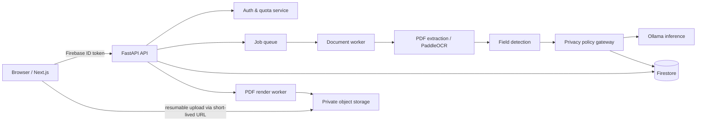
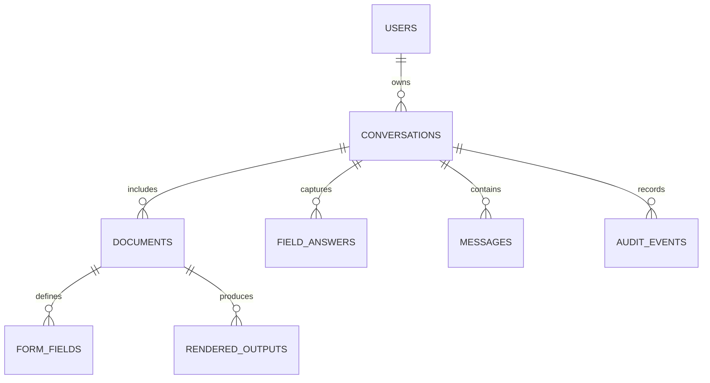

# FormWise AI — Software Design Document

**Status:** Architecture frozen for V1 — implementation may proceed  
**Audience:** Founders, engineering, security, product  
**Version:** 1.0  
**Date:** 2026-07-21

## 1. Executive decision

FormWise AI is viable as a privacy-led, conversational form-completion product, but it must be positioned carefully: it can _assist with understanding and filling eligible fields_, not guarantee submission acceptance, legal correctness, or zero-error OCR. The product’s defensibility is a deterministic privacy boundary and a high-fidelity document pipeline—not an LLM chat interface alone.

The central architectural rule is **policy before AI**. A model may help identify and explain fields, but it must never decide whether it is allowed to solicit, retain, export, or render a value. Those decisions are made by a versioned, deterministic Privacy Engine. Sensitive answer values are neither requested nor stored nor sent to the LLM as user-provided values. OCR may necessarily inspect the uploaded document in FormWise-controlled workers to identify fields; it must not pass sensitive content to the LLM.

### Recommended V1 scope

Start with English PDFs and clear scanned forms, then add Hindi and Telugu UI/questioning. Support common static PDF forms and image-based forms; clearly label complex, handwriting-heavy, or portal-only documents as assisted/manual review. Do not promise every “any paper form” layout can be faithfully recreated in V1.

## 2. Product requirements and non-goals

### Functional requirements

- Google-only sign-in.
- Upload PDF, JPG, JPEG, or PNG; create an immutable document version.
- Extract native PDF widgets/text where present; otherwise run layout-aware OCR.
- Generate a human-reviewable field map: label, type, page, bounding box, confidence, and privacy classification.
- Collect only `SAFE` field answers in a conversational interface in English, Hindi, or Telugu.
- Explain fields in the selected language without requesting sensitive values.
- Populate safe fields and produce a downloadable PDF with sensitive fields visibly marked for manual completion.
- Retain at most five conversations per user; deleting the oldest must also delete associated source/output files and derived data.

### Explicit non-goals for V1

- Submission to government, bank, hospital, or other third-party portals.
- Reading handwriting with an acceptance guarantee.
- Storing a reusable sensitive-data vault.
- Processing OTPs, passwords, PINs, CVVs, Aadhaar/PAN/passport or financial-account values.
- Legal, tax, medical, immigration, or financial advice.

## 3. Critical assumptions to challenge

1. **“Ollama local” is ambiguous.** Ollama on Railway/Render is local to the server, not the user. Form text still leaves the user device. The privacy promise should say “private processing in our controlled environment” unless inference happens on-device.
2. **Firestore is not a file store.** Use an object store for originals and outputs. Firebase Storage is the least-friction V1 choice; use short-lived signed URLs and server-only access.
3. **AI cannot guarantee field classification.** Policy must combine a denylist, pattern detectors, label semantics, and confidence-based manual review. Ambiguity must fail closed.
4. **Preserving the same layout is constrained by source type.** Fillable PDFs are reliable. Flattened/scanned PDFs require calibrated coordinate overlays; low-confidence alignment must block export or require a review screen.
5. **Government, healthcare, and financial forms can have sector-specific duties.** Launch initially with a defined jurisdiction and form categories after legal review; do not market as compliance-certified before an assessment.

## 4. Privacy and data classification

| Tier         | Examples                                                                          | Collection / storage rule                                                                                         |
| ------------ | --------------------------------------------------------------------------------- | ----------------------------------------------------------------------------------------------------------------- |
| `SAFE`       | name, address, email, phone, occupation, education                                | Can be asked and stored only for the active conversation, encrypted at rest.                                      |
| `RESTRICTED` | date of birth, gender, health-related answers, income, caste/religion, signatures | Never asked in V1; highlight for manual completion unless a future policy explicitly enables a reviewed category. |
| `SENSITIVE`  | Aadhaar, PAN, passport, bank account, IFSC, card number, CVV, PIN, OTP, password  | Never asked, accepted, persisted, logged, sent to model, or rendered from user data. Always manual.               |

`RESTRICTED` is deliberately stricter than the brief. It avoids silently treating special-category data as ordinary “safe” information. Policy rules must be versioned, locale-aware, auditable, and evaluated twice: at field discovery and before every message/save/render action.

### Enforcement controls

- Normalize field labels; match exact deny terms, aliases, and contextual phrases; apply pattern detectors for IDs and payment data.
- If any detector marks a field sensitive or confidence is below threshold, choose the more restrictive tier.
- Strip sensitive-looking content from user chat input before persistence; show a non-retentive warning instead of echoing it.
- Give the LLM only an allowlisted field schema and sanitized document snippets—never the original document by default and never answer values outside the active safe field.
- Validate outbound prompts, model outputs, logs, analytics, tracing, and PDF render instructions through the same policy gateway.
- Keep an audit event with field IDs, policy version, action, and decision—never the sensitive value.

## 5. System architecture



Use a modular monolith for the API and workers in V1, with clear domain interfaces. This is materially simpler and safer for 50 users than microservices. Run long OCR/render tasks asynchronously; the browser polls or receives server-sent events for status.

### Components

| Component           | Responsibility                                                | Replaceable boundary       |
| ------------------- | ------------------------------------------------------------- | -------------------------- |
| Next.js web app     | Auth UI, dashboard, upload, review, chat, settings            | BFF/client API interface   |
| FastAPI API         | Authorization, orchestration, validation, signed URLs, quotas | REST/OpenAPI               |
| Document worker     | MIME validation, extraction, OCR, image normalization         | `DocumentExtractor`        |
| Form intelligence   | field candidates, section mapping, confidence, review flags   | `FieldDetector`            |
| Privacy Engine      | classify/enforce/redact every data flow                       | `PrivacyPolicy`            |
| Conversation Engine | state machine and safe-question sequencing                    | `ConversationOrchestrator` |
| AI Provider layer   | structured generation, timeouts, model routing                | `AIProvider`               |
| Render engine       | widget fill/coordinate overlay/highlights                     | `PdfRenderer`              |
| Storage repository  | metadata and encrypted private objects                        | `DocumentRepository`       |

### AI Provider Architecture

The Conversation Engine, Form Intelligence, and explanation features communicate **only** with the `AIProvider` interface. They must not import an Ollama client, model name, provider SDK, or provider-specific response type. The provider interface accepts a provider-neutral request (sanitized context, response JSON schema, locale, task type, timeout, and correlation ID) and returns a provider-neutral structured result (validated JSON, usage metadata, model identifier, latency, and provider error category).

| Adapter          | V1 status            | Responsibility                                                                                   |
| ---------------- | -------------------- | ------------------------------------------------------------------------------------------------ |
| `OllamaProvider` | Enabled/default      | Calls the private Ollama deployment; supports structured JSON responses and local model routing. |
| `GeminiProvider` | Disabled placeholder | Contract-compatible adapter only; no credentials, calls, or fallback enabled in V1.              |
| `GroqProvider`   | Disabled placeholder | Contract-compatible adapter only; no credentials, calls, or fallback enabled in V1.              |

Provider selection is configuration, not business logic: `AI_PROVIDER=ollama` in V1; a future deployment can select `gemini` or `groq` only after an explicit privacy, legal, security, and data-residency review. Startup validation must reject an unknown or disabled provider. There is no automatic cloud fallback: an Ollama outage fails safely with a retry/manual-review state rather than silently transferring form content to another provider.

The Privacy Gateway remains in front of every adapter. A provider change cannot bypass sanitization, policy checks, schema validation, audit events, consent disclosures, retention rules, or outbound-prompt inspection. This isolation also permits provider-specific health checks and model evaluation without leaking into core business logic.

## 6. End-to-end workflow

1. Browser signs in with Firebase Google provider; API verifies the Firebase ID token using Admin SDK.
2. API creates a `document` record and returns a single-purpose, short-lived upload URL after checking user quota and MIME/size limits.
3. Browser uploads directly to private storage. Storage finalization or browser confirmation enqueues a job; the API never accepts arbitrary document bytes in a chat request.
4. Worker virus-scans, detects real file type, decrypts/reads the object, extracts native PDF AcroForm fields first, and invokes PaddleOCR layout analysis only where needed.
5. Field Detector creates candidate fields with source coordinates and confidence. Privacy Engine assigns the strictest tier and a reason code.
6. User reviews any low-confidence labels/placements. Conversation Engine asks the next safe, required, unresolved field. It receives model-produced structured text only after a schema and policy check.
7. Each answer is type-validated, sanitised, encrypted, and attached to a field ID. An answer that looks sensitive is rejected and not stored.
8. Renderer fills only approved safe fields. It applies a visible manual-completion marker to all restricted/sensitive fields and produces a rendition preview plus output PDF.
9. User downloads through a short-lived URL. Retention worker removes the oldest complete conversation over the five-conversation limit and performs idempotent cascading purge.

## 7. Conversation state machine

`UPLOADED → PROCESSING → REVIEW_REQUIRED | READY → IN_PROGRESS → READY_TO_RENDER → RENDERING → COMPLETED | FAILED | PURGED`

Only `READY`, `IN_PROGRESS`, and `READY_TO_RENDER` can accept chat commands. Every transition records an append-only audit event. A user can delete a conversation immediately; deletion is asynchronous but access is revoked at once.

## 8. Data model (Firestore)

Firestore is suitable for V1 metadata and chat state. Store documents in object storage, not Firestore. Use random document IDs; do not put PII in document paths or indexable IDs.



| Collection             | Essential fields                                                                                                                             |
| ---------------------- | -------------------------------------------------------------------------------------------------------------------------------------------- |
| `users/{uid}`          | `createdAt`, `locale`, `status`, `conversationCount`, `termsVersion`                                                                         |
| `conversations/{id}`   | `uid`, `status`, `createdAt`, `lastActivityAt`, `policyVersion`, `documentIds`, `purgeAt`                                                    |
| `documents/{id}`       | `conversationId`, `ownerUid`, `objectKey`, `sha256`, `mimeType`, `pageCount`, `processingStatus`, `retentionUntil`                           |
| `formFields/{id}`      | `documentId`, `fieldKey`, `label`, `type`, `required`, `page`, `bbox`, `confidence`, `classification`, `classificationReasons`, `manualOnly` |
| `fieldAnswers/{id}`    | `conversationId`, `fieldId`, `encryptedValue`, `valueType`, `validatedAt`, `keyVersion`                                                      |
| `messages/{id}`        | `conversationId`, `role`, `safeContent`, `fieldId`, `locale`, `createdAt`                                                                    |
| `renderedOutputs/{id}` | `conversationId`, `objectKey`, `renderVersion`, `status`, `expiresAt`                                                                        |
| `auditEvents/{id}`     | `uid`, `conversationId`, `action`, `resourceType`, `policyVersion`, `outcome`, `createdAt`, `requestId`                                      |

Do not store raw OCR text indefinitely. Keep it only while the conversation is active, encrypt it, and delete it with the conversation. Hashes are for integrity/deduplication controls, not cross-user content discovery.

## 9. API design

Version every endpoint under `/v1`; expose OpenAPI as the contract. Firebase token is required except health endpoints. Ownership is checked server-side on every resource.

| Area          | Endpoints (representative)                                                                               |
| ------------- | -------------------------------------------------------------------------------------------------------- |
| Session       | `GET /v1/me`, `PATCH /v1/me/settings`                                                                    |
| Upload        | `POST /v1/documents/upload-intents`, `POST /v1/documents/{id}/complete`, `GET /v1/documents/{id}/status` |
| Conversations | `GET/POST /v1/conversations`, `GET/DELETE /v1/conversations/{id}`                                        |
| Form review   | `GET /v1/conversations/{id}/fields`, `PATCH /v1/fields/{id}/review`                                      |
| Chat          | `POST /v1/conversations/{id}/messages`, `GET /v1/conversations/{id}/events`                              |
| Output        | `POST /v1/conversations/{id}/renders`, `GET /v1/renders/{id}`, `POST /v1/renders/{id}/download-url`      |
| Privacy       | `GET /v1/conversations/{id}/privacy-summary`, `GET /v1/conversations/{id}/privacy-events`                |

All mutations accept an idempotency key. Responses use stable error codes such as `POLICY_BLOCKED`, `FIELD_MANUAL_ONLY`, `DOCUMENT_UNSUPPORTED`, `OCR_REVIEW_REQUIRED`, and `CONVERSATION_LIMIT_REACHED`.

## 10. Recommended technology choices

- **Web:** Next.js 15 App Router, TypeScript strict mode, Tailwind CSS, shadcn/ui, React Hook Form + Zod, TanStack Query, next-intl.
- **API:** FastAPI, Pydantic v2, SQLAlchemy only if/when Postgres is adopted, HTTPX, `firebase-admin`, structured JSON logging.
- **Jobs:** Cloud Tasks / Pub/Sub preferred if deployed on GCP; otherwise Redis + Celery/ARQ. A durable queue is mandatory; FastAPI background tasks alone are insufficient.
- **Documents:** PyMuPDF for PDF inspection/widget fill/rasterization; pikepdf/qpdf for PDF sanitization; ReportLab only for annotations/new layers, not primary fidelity.
- **OCR:** PaddleOCR 3.x with PP-StructureV3. It supplies layout, reading-order and table capabilities appropriate for complex forms. [PaddleOCR documentation](https://paddlepaddle.github.io/PaddleOCR/main/en/version3.x/pipeline_usage/PP-StructureV3.html)
- **Validation/security:** ClamAV or managed malware scanning, libmagic-style content detection, OWASP file-upload controls, Google Cloud KMS/Firebase-compatible encryption tooling.
- **Observability:** OpenTelemetry, Sentry with PII scrubbing, Cloud Logging/metrics. Disable session replay on sensitive screens.

### Ollama model policy

Use structured outputs with JSON Schema and low temperature. The primary model recommendation is **Qwen3 14B** for production-quality multilingual extraction/explanations on a GPU-backed worker; use **Qwen3 8B** for beta cost/latency and **Qwen3 4B** only for lower-risk UI explanations. Qwen3 advertises broad multilingual capability and current Ollama variants from 4B through 30B. [Ollama Qwen3 library](https://ollama.com/library/qwen3)

Use a separate model evaluation set of anonymized/synthetic English, Hindi, and Telugu forms before selecting a final model. Do not use embeddings/RAG in V1 unless users search their own documents; if later needed, Qwen3 Embedding is multilingual. [Ollama Qwen3 Embedding](https://ollama.com/library/qwen3-embedding)

## 11. Privacy Dashboard

Privacy transparency is a core user feature, not a compliance afterthought. Each conversation has a Privacy Dashboard accessible from the chat and the completed-form screen. It explains decisions in plain language, using the current interface locale, and never reveals sensitive values or pattern matches.

The dashboard shows:

- Count and labels of safe fields processed (values remain hidden by default).
- Count, label, and plain-language reason for sensitive/restricted fields skipped and marked for manual entry.
- What the document/OCR worker processed: the uploaded document to detect its layout and fields, in FormWise-controlled infrastructure.
- What the LLM received: only the approved safe-field schema and necessary sanitized form text; never user-entered sensitive data.
- What never entered LLM processing: sensitive/restricted answer values and direct identifiers classified as manual-only.
- Policy version, field-classification timestamp, model identifier, selected provider, and processing mode (for V1: “Private Ollama server”; only say “on-device” when that is factually true).
- A link to request deletion and a clear retention/quota statement.

`privacySummaries` are derived server-side from field classifications, policy decisions, and audit events. The browser must not calculate privacy assertions from raw form data. Every visible claim is traceable to the policy version and audit event sequence, and a refreshed summary is generated after field review, answer validation, provider call, render, or deletion.

Add a `privacySummary` projection to each conversation: `policyVersion`, `providerId`, `processingMode`, `safeFieldCount`, `restrictedFieldCount`, `sensitiveFieldCount`, `aiDataCategories`, `excludedDataCategories`, `lastEvaluatedAt`, and `explanationLocale`. Retain counts/reasons only; do not copy encrypted answers or source document content into this projection.

## 12. Production repository structure

```text
formwise-ai/
  apps/web/                 # Next.js application
  services/api/             # FastAPI routes and dependency wiring
  services/worker/          # queued OCR/render processors
  packages/contracts/       # OpenAPI-generated / shared schemas
  packages/policy/          # versioned classification rules and fixtures
  packages/ai-provider/     # neutral interface plus Ollama/Gemini/Groq adapters
  packages/document-core/   # extraction, field map, rendering abstractions
  infra/                    # Docker, IaC, deployment manifests
  docs/                     # ADRs, threat model, runbooks, SDD
  tests/fixtures/           # synthetic and permitted test forms only
```

Within each service, organise by domain (`conversations`, `documents`, `forms`, `privacy`, `rendering`, `users`) rather than technical layer alone. Domain code must not import framework routes directly.

## 13. Security strategy

- Verify Firebase tokens server-side; Firebase client SDK access is not authorization.
- Least-privilege service accounts, separate development/staging/production projects, secret manager, key rotation, and no secrets in browser bundles.
- Private bucket; encryption at rest plus application-level envelope encryption for safe answers. Isolate per-conversation data-encryption keys where feasible.
- Presigned upload/download URLs restricted by object, method, size, MIME, and short expiry. Scan/quarantine before processing.
- Enforce size/page/pixel limits, decompression-bomb checks, PDF parser sandboxing, subprocess resource limits, and network egress denial for document workers.
- CSP, CSRF protections where cookie sessions exist, secure headers, strict CORS allowlist, rate limits per UID/IP, bot abuse controls, and request IDs.
- PII-safe logs, redaction tests, immutable audit records, retention scheduler, delete verification, backup retention aligned to deletion policy.
- Threat-model prompt injection: uploaded text is untrusted data, never instructions; LLM tools disabled; structured output schema plus validation only.

## 14. Deployment architecture

For the stated stack: Vercel hosts the web app; a Dockerised FastAPI API, worker deployment, OCR runtime, and Ollama inference run separately. Do **not** colocate CPU-heavy OCR/LLM workloads with the request API. Railway/Render can work for a closed beta, but use GPU-capable, private-networked compute for reliable inference and choose an object store/queue with an explicit region and data-processing agreement.

Recommended environments: `dev`, `staging`, and `prod`, each isolated by Firebase project, storage bucket, secrets, and service account. CI builds immutable images, runs tests/scans, and promotes a tagged release after approval. Autoscale workers by queue depth; cap concurrent OCR/render tasks to protect memory.

For enterprise readiness, make storage, queue, LLM, and database provider adapters configuration-driven. A future move to Cloud Run/GKE + Postgres is then evolutionary, not a rewrite. The Next.js App Router remains a sensible frontend foundation. [Next.js App Router documentation](https://nextjs.org/docs/app)

## 15. Scalability and reliability

The V1 cap is 50 users, so prioritise correctness over distributed complexity. Still establish these limits from day one: per-user upload rate, maximum source size/page count, concurrent processing cap, queue retry with dead-letter handling, idempotency, exponential backoff, timeouts, circuit breakers around Ollama, and separate liveness/readiness checks.

Suggested service objectives: API authorization p95 under 500 ms (excluding file/AI work); upload acknowledgement under 2 s; OCR/render status visible within 3 s; 99% successful processing for supported fixture corpus. Measure classification false-negative rate as a privacy-critical metric and block release if it regresses.

## 16. Testing and quality gates

| Layer             | Required coverage                                                                                                             |
| ----------------- | ----------------------------------------------------------------------------------------------------------------------------- |
| Unit              | policy classifier, redaction, field validation, quota deletion ordering, coordinate transforms                                |
| Contract          | web/API OpenAPI compatibility and auth/error schemas                                                                          |
| Integration       | Firebase emulator, private storage, queue, OCR worker, rendered PDF lifecycle                                                 |
| Golden document   | approved synthetic forms compare field map and rendered pixel/coordinate tolerances                                           |
| Security          | upload fuzzing, authz/IDOR, malware/quarantine, secret scanning, dependency/SAST scans                                        |
| AI evaluation     | multilingual fixtures, prompt-injection documents, sensitive-label aliases, OCR noise, strict false-negative gates            |
| Provider contract | every enabled/placeholder adapter satisfies the same request/result contract; disabled providers cannot be selected or called |
| Privacy dashboard | claims reconcile with policy/audit fixtures; zero sensitive values or raw OCR text appear in API/UI responses                 |
| End-to-end        | Google auth test identity, upload → review → safe chat → render → deletion                                                    |

No real customer documents belong in test fixtures or developer laptops. Regression tests must include adversarial labels such as “ID number,” “security code,” and local-language equivalents, not only explicit English terms.

## 17. Coding and operational standards

- TypeScript/Python strict typing; format/lint/type-check in CI; conventional commits; small reviewed pull requests.
- API schema first; no unversioned breaking API change; ADR for consequential choices.
- UTC timestamps, correlation IDs, explicit error taxonomy, configuration through typed environment settings.
- Every policy change requires security review, fixture additions, model-evaluation report, and a version increment.
- Maintain runbooks for malware detection, deletion requests, model outage, queue backlog, suspected data exposure, and OCR accuracy regressions.

## 18. Phased delivery plan and approval gates

1. **Foundation:** threat model, privacy policy taxonomy, data retention policy, UX prototypes, fixture corpus, cloud-region/legal decision.
2. **Document pipeline:** authenticated upload, file safety, extraction/OCR, field review, deterministic classification, audit trail.
3. **Conversation and render:** safe-only dialogue, multilingual UI, validation, PDF overlay, deletion/quota enforcement.
4. **Beta hardening:** external security review, accessibility pass, load/evaluation testing, incident runbooks, monitored closed beta.

### Decisions required before implementation

- Confirm the operating region and the exact privacy statement: server-local inference versus on-device inference.
- Approve the `RESTRICTED` tier and manual-only treatment for date of birth, health, income, religion/caste, gender, and signatures in V1.
- Select storage/queue provider and whether Firebase Storage is acceptable alongside Firestore.
- Define supported V1 document limits and form categories.
- Obtain legal/compliance review for target geography and launch claims.

This SDD is frozen alongside the final review in `docs/ARCHITECTURE_FREEZE_REVIEW.md`.
